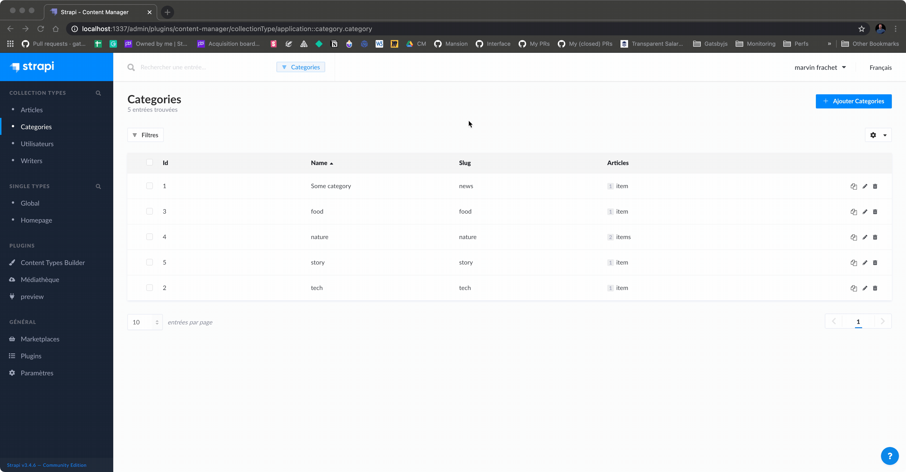

An **experimental** attempt to provide "preview" possibilities in any web-frontend using [Strapi](https://strapi.io/).

## The problem

How to provide content preview when building a headless CMS?

## How this package tries to solve that? 

When using this project, inside the Strapi application, on the left side bar, plugin section, there will be a "Preview" link. When clicking this link, an application will be loaded into an iframe.

This application (the one in the iframe) has to require a tiny script located in the [strapi-preview-client](./packages/strapi-preview-client) package like in the [react-test-app](packages/react-test-app/src/index.js) package.

After doing all of this, the plugin is able to browse every single element owning a `data-strapi-entity` attribute and **make them editable and persistent**. **This should allow for being agnostic from the frontend framework used.**

This `data-strapi-entity` attribute should have the following shape:

```jsx
const SomeComponent = ({ articleId }) => {
  const article = useArticle(articleId);

  return (
    <div data-strapi-entity={`articles::title::${articleId}`}>
      {article.title}
    </div>
  );
};
```


## What it looks like?

_Note: the permissions for CRUD are shared between the logged-in user in the Strapi app and the editing experience._

_Note 2: it works in "detached" mode. You can open the client application outside Strapi and it should work seemlessly_



## How to test it?

```sh
$ git clone https://github.com/mfrachet/strapi-plugin-preview
$ cd strapi-plugin-preview
$ yarn # install lerna in the project
$ yarn bootstrap # install all dependencies and link the packages
$ yarn start:strapi # start the strapi backoffice

# in another terminal
$ yarn start:client # start the create react app
```

## What is in this repository?

```sh
.
├── README.md
├── docs
├── lerna.json
├── package.json
├── packages
│   ├── react-test-app        # the create-react-app application, a "user-land" one
│   ├── strapi-app            # the strapi backoffice for testing the plugin
│   ├── strapi-plugin-preview # the plugin itself
│   └── strapi-preview-client # the tiny script to add to the "user-land" application
└── yarn.lock
```

## TODO

- [ ] Draft and publish (must have, I think)
- [ ] Checking permissions before allowing to edit the content (token already available)
- [ ] Prevent the first "flash" screen because of polling-url / handshake
- [ ] Use the design system components
- [ ] Allowing configurations (passing the client URL, managing CORS etc...)

Add other if necessary